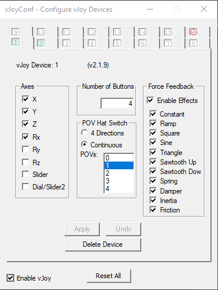

# Mechwarrior 2 - 31st Century Combat

## Game Installation

Mechwarrior 2 and expansions are currently free/abandonware - you can legally download them for free, although I
recommend you make sure it's a trusted site before doing so. I used the portable installer by u/Narcopolypse
[here.](https://www.reddit.com/r/mechwarrior/comments/eatbyd/mechwarrior_2_portable/), although I ended up using
[dosbox-x](https://dosbox-x.com/) instead of the packaged dosbox.

## Joystick Setup

### vJoy

#### 1. Installation

If you haven't already, download and install [vJoy.](https://sourceforge.net/projects/vjoystick/)

#### 2. Configure vJoy device

Run vJoyConf.exe (mine was in c:\ program files\vjoy\x64, or type "configure vjoy" at the start menu). If this is the
first vjoy device you've set up, vJoyconf should default to the first tab. If it's not the first device you've created,
I recommend choosing another tab and creating a new (virtual) device. Either way, make sure you note down somewhere
which virtual
device goes to which game - As far as I know, there's no way to rename them (unfortunately).

It's important to note here that DOS has a much smaller limit on the number of buttons and axes a joystick can have.
As I understand it, this is because joysticks at the time were connected via a specific 'gamepad' port, of which there
were typically only a maximum of two; each supported two axes and two buttons worth of input. fancier joysticks at the
time would use both ports simultaneously for a maximum of 4 axes and 4 buttons.

on the tab for the appropriate virtual device, choose the following options:

- Axes
    - check X,Y, Z, Rx
- Number of Buttons
    - 4
- POV Hat Switch
    - continuous
    - 1 switch
        - This can probably be left at 0, as I don't think dos can recognize four axes, four buttons, and a hat switch
          at
          the same time. I've included it nonetheless because I know this configuration worked for me.
- Force Feedback
    - I have all these boxes checked, but similar to the hat switch these can probably be left unchecked.

|  |
|---------------------------------------------------------------------------------------------|
| *The vJoy device configuration that I use for Mechwarrior 2*                                |

### Joystick Gremlin

#### 1. Installation

If you haven't already, download and install [Joystick Gremlin.](http://whitemagic.github.io/JoystickGremlin/)

#### 2. Configure Joystick Gremlin

This configuration should be much simpler. Run Joystick Gremlin (either from the start menu, or from the exe) - You'll
probably want to create a handy shortcut to this somewhere.

Create a new Profile and save it as a distinct name.

Map a couple of axes from your physical joystick(s) to the vJoy device you created earlier. Make sure to map at least
one button to the joystick buttons! You may not want to map *everything* until you know that the game is actually
recognizing your joystick - you can always come back later. Save your changes!

I've included the most recent mapping that I've used under 'configs'. *THIS PROBABLY WILL NOT WORK FOR YOU AS-IS*.
Unless you have exactly the same joysticks I do, this will not work out of the box. Use it as an example of how to map
physical devices to virtual ones. A walkthrough of using joystick gremlin is out of the scope of this guide; however,
the official documentation is available [here.](https://whitemagic.github.io/JoystickGremlin/overview/)

Don't forget to activate your profile when launching the game, otherwise you won't have any joystick input!

### DosBox

#### 1. Joystick setup

The [joystick] section of your dosbox.conf file should look like this:

```
[joystick]
# <Documentation omitted for clarity>
joysticktype  = 4axis
timed         = false
autofire      = false
swap34        = false
buttonwrap    = false
joy1deadzone1 = 0.25
joy1deadzone2 = 0.25
joy2deadzone1 = 0.25
joy1response1 = 1.00
joy1response2 = 1.00
joy2response1 = 1.00
joy1axis0     = 0
joy1axis1     = 1
joy1axis2     = 2
joy1axis3     = 3
joy1axis4     = 4
joy1axis5     = 5
joy1axis6     = 6
joy1axis7     = 7
joy2axis0     = 0
joy2axis1     = 1
joy2axis2     = 2
joy2axis3     = 3
joy2axis4     = 4
joy2axis5     = 5
joy2axis6     = 6
joy2axis7     = 7

```

The most important pieces of this is `joysticktype = 4axis`. This ensures that dosbox will recognize your virtual
joystick as a single 4-axis 4-button joystick, and emulate it as such.

## Running the game

### 1. Pre-launch

Almost time for the fun part!
Before you run DosBox, open up the Windows game controller control panel (start menu ->
type 'joy.cpl').

|               |
|-------------------------------------------------------------------------------------------------|
| *Joy.cpl - note that there are two vJoy Device entries listed, as I have 2 vJoy Devices set up* |

Click on the 'Advanced...' button, and choose your vJoy device from the "Preferred Device" dropdown. The vJoy devices
should appear in this list in numeric order - i.e., the first one in the list is vJoy device 1, the second is vJoy
device 2, etc. choose the one that matches the vJoy device you set up for Mechwarrior 2.

|  |
|-----------------------------------------------------------------------------------------------------------------------|
| *Selecting vJoy device 1 as the preferred controller*                                                                 |

If you skip this step, *DosBox will use the wrong joystick*!

### 2. Launch the game and configure the cockpit controls

Activate your joystick Gremlin profile and launch the game, but don't deploy just yet!

Hit escape and go to 'Cockpit Controls'. Select 'Keyboard' and 'MS Sidewinder (CH Pro Mode)' as your input devices -
they should be red, while the other options are white.

Click 'CUSTOM CONFIGURATION' and bind the joystick axes to whatever controls you like. Once you've got at least one axis
bound, Save your config, then click 'ACCEPT CONFIG AND EXIT'

### 3. Calibration

Next, we need to do joystick calibration, and the easiest way to do that is through the tutorial missions. Make your
way to 'cadet training', and launch one of the training missions. You should be prompted to do device calibration - If
you aren't, hit escape -> 2 -> 1 to calibrate the joystick now.

This is important - whenever it prompts you to 'CLICK' something, it means "*push a button on the joystick*", *NOT* "
click
the mouse button"! This must be a button you assigned to the virtual joystick in joystick gremlin, NOT one you mapped to
a keyboard input! Follow the rest of the instructions so that it can learn what the extent of your axes are.

### 4. Button mapping

Now that you've got your joystick calibrated, take some time to map the rest of the controls. I find that it's easiest
to keep the default keyboard layout, and just bind buttons to it using joystick gremlin. notably, you can change the key
bindings in joystick gremlin by just deactivating and reactivating your profile, rather than having to restart the
mission/the game/ dosbox.

## Play the Game

It's worth noting that Mechwarrior 2 uses "Absolute Positioning" for the joystick by default - that is, the amount 
you've moved the stick corresponds to how far the torso moves (relative to its possible range of motion), not how fast 
it does the twisting. For a *much* more thorough breakdown on what that means, check out [this excellent writeup] by 
Loc Nar on the MWO forums. 

Setup should now be complete - time to play the game, mechwarrior! Good Hunting, and good salvage!
