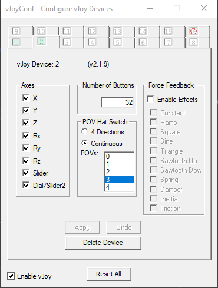
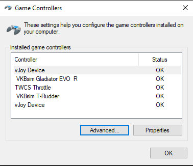
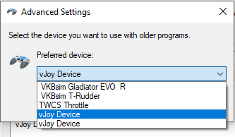

# Mechwarrior 2 - 31st Century Combat

## Game Installation

Mechwarrior 3 and the Pirate's Moon expansion are currently free/abandonware - you can legally download them for free,
although I recommend you make sure it's a trusted site before doing so. I used the installation guide written by
Tyler799, which can be found [here.](https://github.com/Tyler799/Mechwarrior3Guide/blob/master/Guide.md)

## Joystick Setup

### vJoy

#### 1. Installation

If you haven't already, download and install [vJoy.](https://sourceforge.net/projects/vjoystick/)

#### 2. Configure vJoy device

Run vJoyConf.exe (mine was in c:\ program files\vjoy\x64, or type "configure vjoy" at the start menu). If this is the
first vjoy device you've set up, vJoyConf should default to the first tab. If it's not the first device you've created,
I recommend choosing another tab and creating a new (virtual) device. Either way, make sure you note down somewhere
which virtual device goes to which game - As far as I know, there's no way to rename them (unfortunately).

Unlike 2 and it's expansion packs, Mechwarrior 3 seems to handle joysticks significantly better - although it only
recognized one, for me. I went ahead and checked all of the axes, chose 32 buttons, and 3 HAT switches. That being said,
all you really need here are enough axes to cover the analog inputs you want to use. Everything else can be mapped to
keyboard inputs.

|  |
|---------------------------------------------------------------------------------------------|
| *The vJoy device configuration that I use for Mechwarrior 3*                                |

### Joystick Gremlin

#### 1. Installation

If you haven't already, download and install [Joystick Gremlin.](http://whitemagic.github.io/JoystickGremlin/)

#### 2. Configure Joystick Gremlin

This configuration should be much simpler. Run Joystick Gremlin (either from the start menu, or from the exe) - You'll
probably want to create a handy shortcut to this somewhere.

Create a new Profile and save it as a distinct name.

Map a couple of axes from your physical joystick(s) to the vJoy device you created earlier. Make sure to map at least
one button to the joystick buttons! You may not want to map *everything* until you know that the game is actually
recognizing your joystick - you can always come back later. Save your changes!

I've included the most recent mapping that I've used under 'configs'. *THIS PROBABLY WILL NOT WORK FOR YOU AS-IS*.
Unless you have exactly the same joysticks I do, this will not work out of the box. Use it as an example of how to map
physical devices to virtual ones. A walkthrough of using joystick gremlin is out of the scope of this guide; however,
the official documentation is available [here.](https://whitemagic.github.io/JoystickGremlin/overview/)

Don't forget to activate your profile when launching the game, otherwise you won't have any joystick input!

## Running the game

### 1. Pre-launch

Almost time for the fun part!
Before you run the game, open up the Windows game controller control panel (start menu ->
type 'joy.cpl').

|                 |
|-------------------------------------------------------------------------------------------------|
| *Joy.cpl - note that there are two vJoy Device entries listed, as I have 2 vJoy Devices set up* |

Click on the 'Advanced...' button, and choose your vJoy device from the "Preferred Device" dropdown. The vJoy devices
should appear in this list in numeric order - i.e., the first one in the list is vJoy device 1, the second is vJoy
device 2, etc. choose the one that matches the vJoy device you set up for Mechwarrior 3.

|  |
|---------------------------------------------------------------------------------------------------------------------|
| *Selecting vJoy device 1 as the preferred controller*                                                               |

If you skip this step, *the game will use the wrong joystick*!

### 2. Launch the game and configure the controls

This should be pretty easy. Unlike Mechwarrior 2, there is no in-game joystick calibration to deal with - only mapping
axes and buttons. Assuming you chose the correct vJoy device in the previous step, this should just work.

To test out the joystick binding without having to load a mission, enter the controls menu (Options -> Controls). When
you click the "Assign Device Axis" button, a popup window will appear with a menu to cycle through the different axes
available to you. Underneath that menu, there should be a bar showing the current state of that axis. It updates in real
time, so use that to make sure your physical joystick inputs line up with what you expect.

|      |
|-------------------------------------------------------------------------------|
| *The 'Assign Device Axis' popup - this show joystick axis Z set to abut 50%.* |

## Play the Game

Unlike Mechwarrior 2, Mechwarrior 3 defaults to "Relative Positioning" by default for the joystick - that is, the amount
you've moved the stick corresponds to how fast the torso moves, instead of where it ends up relative to its possible
range of motion. To choose absolute positioning mode instead, set "Torso Auto Return" to "On" in the options menu. For a
*much* more thorough breakdown on what that means, check out [this excellent writeup] by Loc Nar on the MWO forums.

Setup should now be complete - time to play the game, mechwarrior! Good Hunting, and good salvage!
